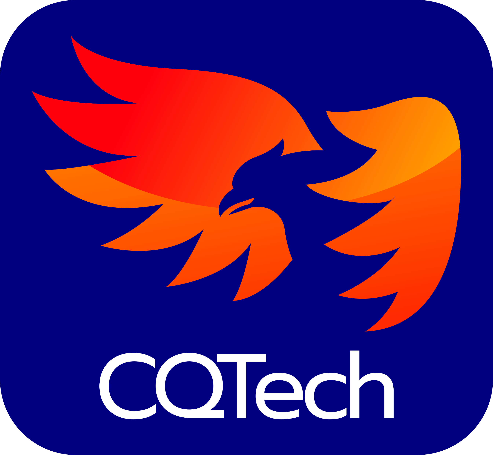

  
  

## QWorld's TQC-QCourse
Welcome to  Topological Quantum Computing (TQC) QCourse!

TQC-QCourse is an introductory course to the facinating quantum computing architecture based on the concept of toplogy introduced by [Kitaev in 1997](https://arxiv.org/pdf/quant-ph/9707021.pdf).

Most implementations of a quantum computer are highly susceptible to errors. A major source of error in quantum computation is decoherence, caused by interactions between the quantum state and the environment. Local perturbations can also cause errors in many quantum systems, as can imperfections in the execution of quantum operations. This results in notable overheads devoted to error correction schemes, which only work in computers with a sufficiently low basic error rate, which makes implementing such a quantum computer very difficult. One way to mitigate the effect of these errors is in using topological quantum computing. These topological quantum computers can be implemented using non-Abelian anyons, which are quasiparticles in two-dimensional systems that exhibit exotic exchange statistics, beyond a simple phase change.

## Prerequisite
The prerequisite for TQC-QCourse is having completed the [QBronze](https://qworld.net/workshop-bronze/) material or a similar course with basic knowledge of complex numbers.

## Content

Please refer to [Content](https://github.com/Constantine-Quantum-Tech/tqc-course/blob/main/content.ipynb). 
In addition to the notebooks a whole an open-source library for simulating topological quantum computer based on anyons built [TQSim](https://github.com/Constantine-Quantum-Tech/tqsim) (Topological Quantum Simulator) has been developped by the course's authors.

## Making Contributions

Please make a merge request or create an issue for reporting typo or your corrections. 
If you are interested, you are welcome to contribute to TQC-QCourse. Please read [QWorld's rules for developing projects](http://qworld.lu.lv/wp-content/uploads/2020/09/Rules-for-the-projects-developed-under-the-QEducation-2020-Sep-22.pdf).

## License

The text and figures are licensed under the Creative Commons Attribution 4.0 International Public License (CC-BY-4.0), available at https://creativecommons.org/licenses/by/4.0/legalcode.

The code snippets in the notebooks are licensed under Apache License 2.0, available at http://www.apache.org/licenses/LICENSE-2.0.

## Credits
TQC-QCourse has been prepared by Abdellah Tounsi, Nacer eddine Belaloui, Mohamed Messaoud Louamri and Mohamed Taha Rouabah as part of Constantine Quantum Technologies (CQTech)'s quantum education activities. The valuable contribution of Prof. Achour Benslama (proofreading and corrections) helped to improve the course's content.
Part of TQC-QCourse was prepared based on the material produced by Constantine Quantum Technologies team in the QWorld Quantum Hardware-Education-Challenge, Womanium Quantum Hackathon 2022.
TQSim simulator has been developed by the course's authors based on the PhD thesis work of Abdellah Tounsi.

