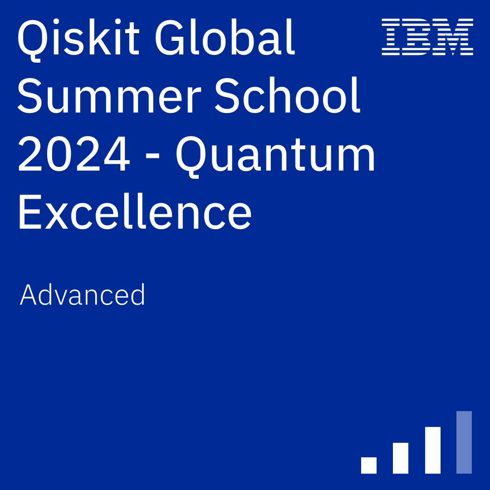

# 🧠 Quantum Computing Portfolio

Welcome to my personal quantum computing journey!  
This repository collects certificates, badges, and milestones from my learning path between **2023–2025**, including participation in official Qiskit and QWorld programs.

---

## ⚛️ What is Quantum Computing?

**Quantum computing** is a new paradigm of computation that leverages the principles of quantum mechanics — such as **superposition**, **entanglement**, and **quantum interference** — to process information in fundamentally different ways compared to classical computers.

Unlike classical bits (0 or 1), **quantum bits (qubits)** can exist in a superposition of states, enabling quantum computers to evaluate many possibilities simultaneously. This leads to exponential speedups for certain problems.

### 🚀 Why Quantum Computing Matters

Quantum computing holds the promise to transform industries and scientific fields by solving problems that are intractable for classical machines. Some key **advantages** include:

- 🔐 **Cryptography:** Quantum algorithms (like Shor’s) can break current encryption schemes and also enable new secure protocols via quantum key distribution.
- 🧪 **Chemistry & Materials Science:** Simulate molecular and atomic systems with high precision, enabling breakthroughs in drug discovery, materials design, and climate modeling.
- 📈 **Optimization:** Solve complex optimization problems in logistics, finance, and AI more efficiently using quantum heuristics or hybrid algorithms.
- 🧠 **Machine Learning:** Improve pattern recognition and model training with quantum-enhanced data processing techniques.
- ⚡ **Speedup Potential:** Certain quantum algorithms can outperform classical ones exponentially (e.g., Grover’s algorithm for search, quantum phase estimation, etc.).

---

## 🏅 Certifications & Achievements

### 📚 QClass by QWorld (2023–2025)

<!-- 

 -->

---

### 💠 IBM Quantum & Qiskit Programs

#### 🔷 Quantum Explorer 2023

    

#### 🔷 Qiskit Global Summer School

---

## 🧠 About Me

I'm passionate about quantum technologies and actively participating in programs that strengthen my foundation in:

- Quantum algorithms & programming
- Quantum error correction
- Quantum hardware & simulation
- Hands-on Qiskit labs

This repository serves as a personal archive and inspiration to continue advancing in the field of quantum computing.

---

## 📬 Connect

Feel free to connect with me on [LinkedIn](https://www.linkedin.com/in/diegogerwig)  
or visit my [GitHub profile](https://github.com/diegogerwig) to explore more projects.

